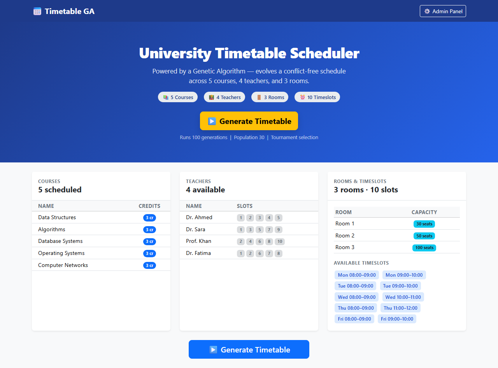
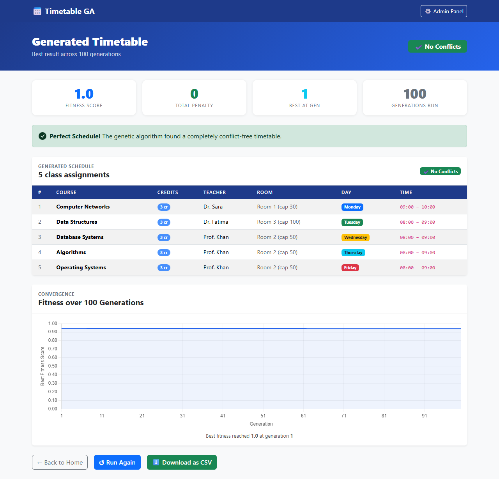
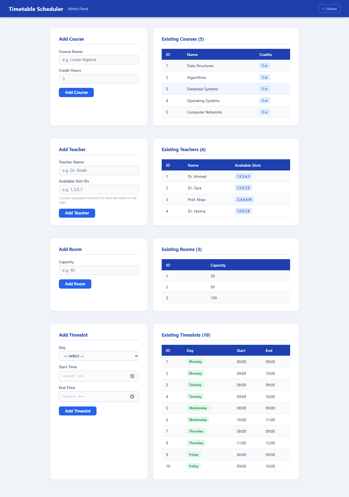

# Timetable GA

A university timetable scheduler built with Flask and a custom Genetic Algorithm. Given a set of courses, teachers, rooms, and timeslots, it evolves a conflict-free schedule over 100 generations and displays the result as a sortable weekly timetable.

## Screenshots

**Home — data overview and GA trigger**


**Result — generated timetable with fitness history**


**Admin — manage courses, teachers, rooms, and timeslots**


## Features

- **Genetic Algorithm engine** — tournament selection, single-point crossover, per-gene mutation, elitism
- **Constraint handling** — hard penalties for teacher/room/course clashes; soft penalties for back-to-back classes
- **Admin panel** — add courses, teachers, rooms, and timeslots without touching the database
- **CSV export** — download the generated timetable as a spreadsheet
- **Pre-seeded data** — ships with 9 courses, 9 teachers, 13 rooms, and 20 weekly timeslots drawn from a real university dataset

## Tech Stack

- Python 3 / Flask
- SQLite (via the standard library `sqlite3`)
- Vanilla HTML/CSS (no JS framework)

## Getting Started

```bash
# 1. Clone the repo
git clone https://github.com/MuhammadTalhaJoiya/timetable-ga.git
cd timetable-ga

# 2. Install dependencies
pip install -r requirements.txt

# 3. Run the development server
python app.py
```

Open `http://127.0.0.1:5000` in your browser.

The database is created and seeded automatically on first run — no migrations needed.

## Usage

| Page | URL | What it does |
|------|-----|--------------|
| Home | `/` | Overview of loaded data; trigger the GA |
| Result | `/generate` (POST) | Runs the GA and shows the best timetable found |
| Admin | `/admin` | Add courses, teachers, rooms, timeslots |
| Export | `/export` | Download the last generated timetable as CSV |

Click **Generate Timetable** on the home page to run the algorithm. The result page shows the schedule sorted by day/time, the best fitness score (1.0 = zero conflicts), total conflicts, and a per-generation fitness history.

## How the GA Works

| Parameter | Value |
|-----------|-------|
| Population size | 30 |
| Generations | 100 |
| Tournament size | 3 |
| Mutation rate | 10% per gene |
| Elitism | top 2 carried over |

**Chromosome** — one gene per course; each gene is a `(course, teacher, room, timeslot)` tuple chosen randomly from the database.

**Fitness** — `1 / (1 + penalty)`, where penalty accumulates:
- `+10` for each teacher clash, room clash, or duplicate-course overlap (hard constraints)
- `+2` for each pair of back-to-back classes taught by the same teacher (soft constraint)

A fitness of **1.0** means a perfectly conflict-free schedule. The algorithm stops early if this is reached before generation 100.

## Project Structure

```
timetable-ga/
├── app.py                     # Flask routes
├── ga_engine.py               # Genetic Algorithm implementation
├── models.py                  # SQLite helpers and seed data
├── requirements.txt
├── rich_university_dataset.csv  # Source dataset (reference only)
├── static/
│   └── style.css
└── templates/
    ├── index.html
    ├── admin.html
    └── result.html
```

## License

MIT
